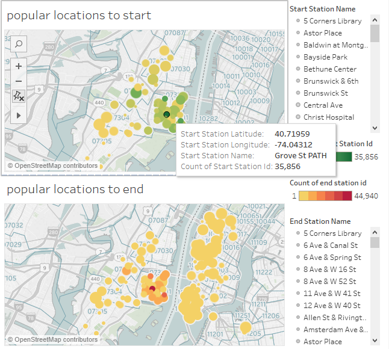
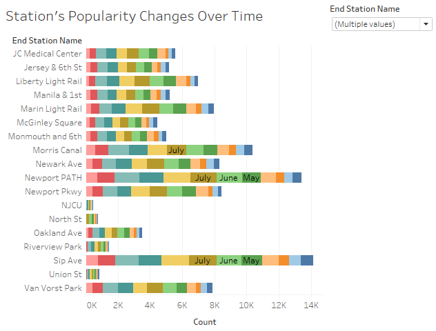
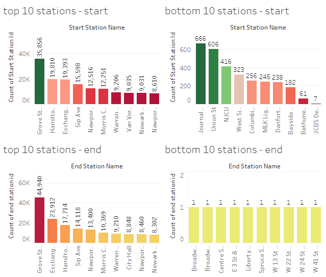
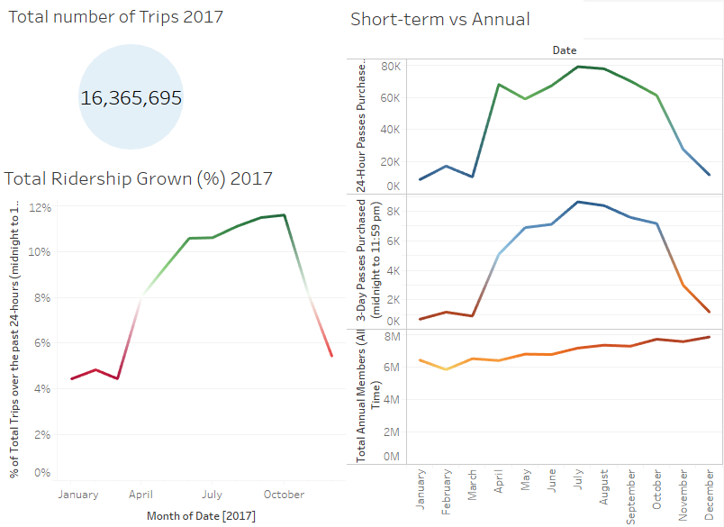
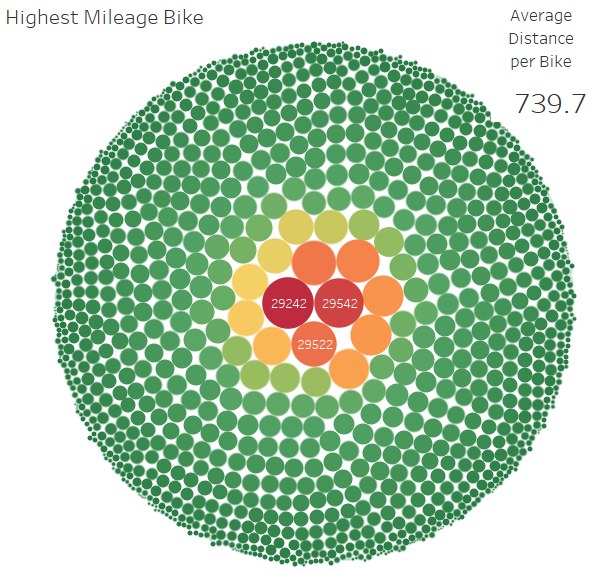
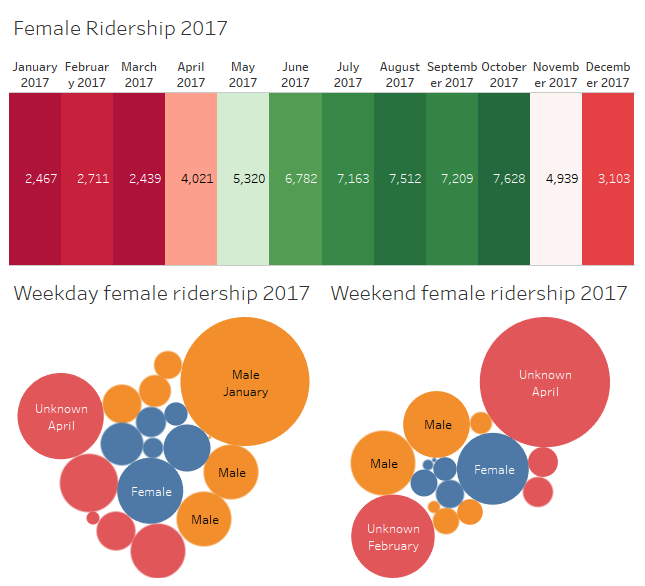
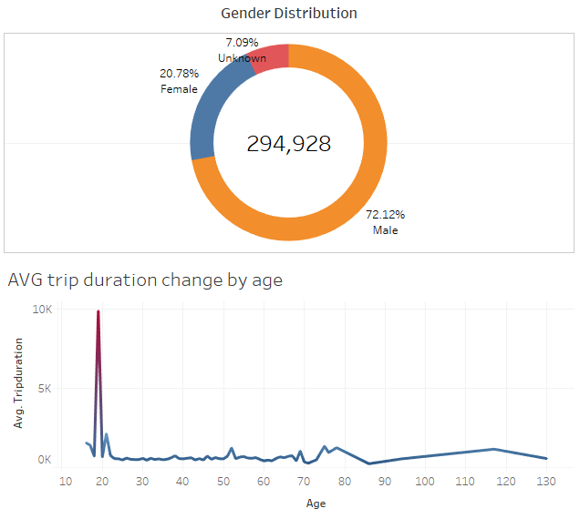
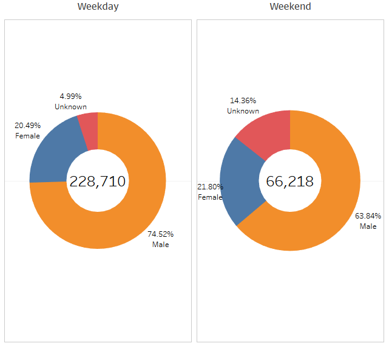
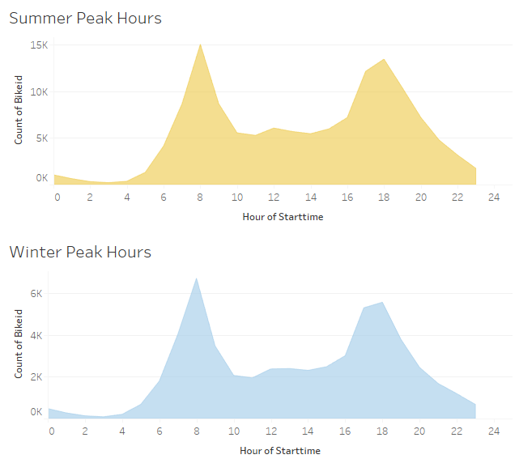

# Tableau_Challenge

## Citibike Analysis

Analysis for the New York City "Citi Bike" Program, the largest bike sharing program in the United States. 

## Findings

In this data the findings show from a gender stand point that the majority of riders are men and they tend to have longer trip durations than women. From an age stand point it appears the average age of a rider falls between the ages of 19 and 39. Most user types are labeled as subscribers with a very small percentage labeled as customers.

# Visualizations

